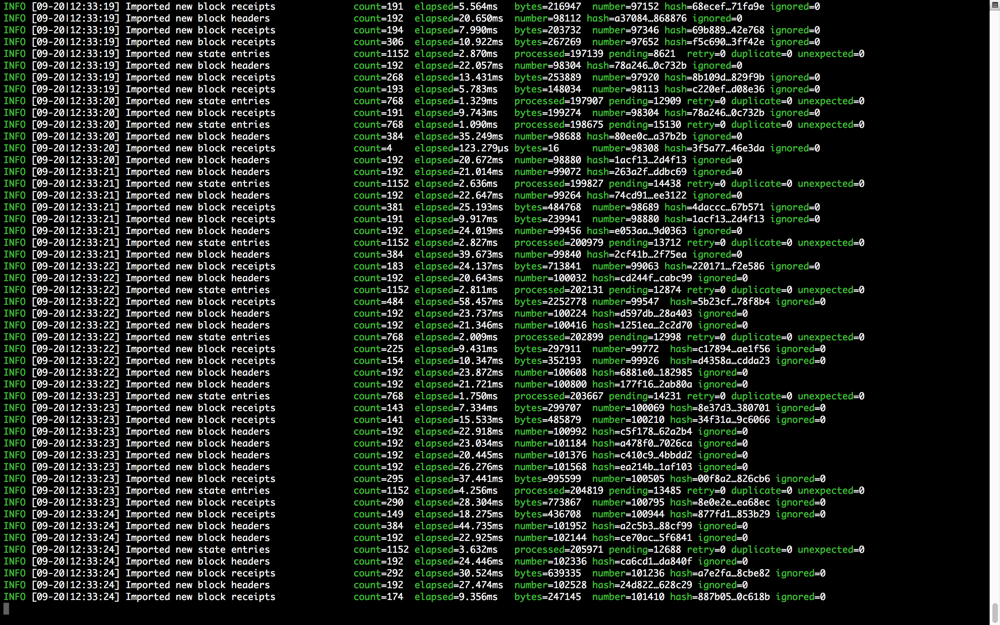
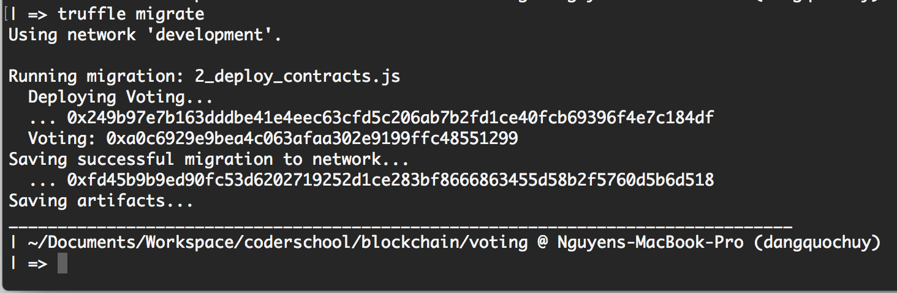
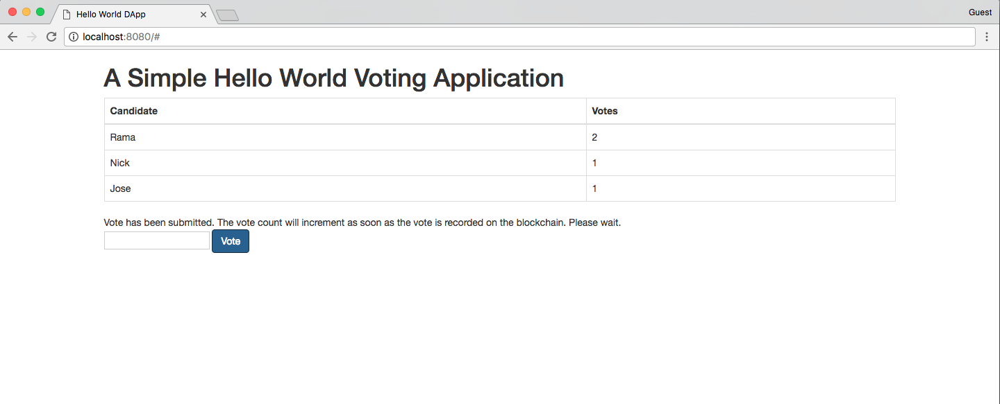

# Voting

Goals:

- Install geth — the client software used to download the blockchain and run the Ethereum node on your local machine.
- Install the Ethereum dapp framework called Truffle which will be used for compiling and deploying our contract.
- Make small updates to our Voting application to make it work using truffle.
- Compile and deploy the contract to the Ropsten testnet.
- Interact with the contract through truffle console and then through a webpage.

## Usage

To initialize a project with this example, run `truffle init webpack` inside an empty directory.

## Building and the frontend

1. First run `truffle compile`, then run `truffle migrate` to deploy the contracts onto your network of choice (default "development").
1. Then run `npm run dev` to build the app and serve it on http://localhost:8080

## Screenshots

### geth

### deploy to Ropsten

### web

-----

Source: [Full Stack Hello World Voting Ethereum Dapp Tutorial — Part 2](https://medium.com/@mvmurthy/full-stack-hello-world-voting-ethereum-dapp-tutorial-part-2-30b3d335aa1f)

